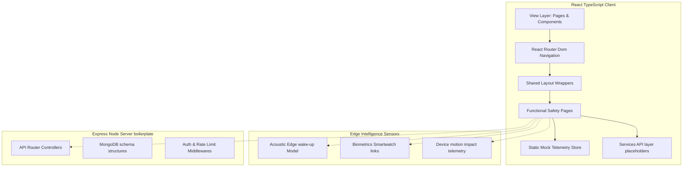

# SafeCircle AI &bull; System Architecture Document

This document outlines the System Architecture and Implementation Strategy of **SafeCircle AI** ("AI Safety Companion for India"). The architecture is designed to support concurrent engineering, allowing a team of three developers to work independently and merge code cleanly.

---

## 🏗️ Architectural Overview

SafeCircle AI implements a **Clean Architecture** model with strict separation of concerns between presentation layouts, core domain logic, sensors integrations, and server telemetry.

---

## 🛠️ Design System & Aesthetic Tokens

The application features a modern, minimal, dark-mode styling utilizing a **Glassmorphism** layout. Custom variables are configured in [tailwind.config.js](file:///c:/Users/A.YUVAN%20AVINASH/Downloads/SafeCircle/tailwind.config.js) and [src/index.css](file:///c:/Users/A.YUVAN%20AVINASH/Downloads/SafeCircle/src/index.css):

- **Primary Accents**:
  - `brand-blue-500` (`#0ea5e9`): Navigation links, secure status indicators, mapping routes.
  - `brand-purple-600` (`#9333ea`): AI elements, voice soundwaves, biometric charts.
  - `brand-red-600` (`#dc2626`): Crisis buttons, SOS alerts, active dispatches.
- **Backgrounds**:
  - Deep Dark Mode base background: `brand-dark-950` (`#030712`).
  - Card Glassmorphism base panels: `glass-panel` (translucent `#111827` backing, `backdrop-filter: blur(12px)` and light border borders).
- **Transitions**:
  - Interactive nodes implement micro-animations: hover border glows (`glass-panel-hover`), slight transitions (`hover:-translate-y-0.5`), and pulse waves.

---

## 👥 Developer Work Division Strategy

The separation of directories ensures developers work in non-clashing files:

### 🎨 Developer Alpha: Frontend UX/UI Architect
- **Focus**: Styling, UI layouts, pages, and interactive presentation.
- **Workflow**:
  1. Modify layouts in [src/layout/DashboardLayout.tsx](file:///c:/Users/A.YUVAN%20AVINASH/Downloads/SafeCircle/src/layout/DashboardLayout.tsx).
  2. Implement reusable dashboard indicators in [src/components/](file:///c:/Users/A.YUVAN%20AVINASH/Downloads/SafeCircle/src/components/).
  3. Customize route maps and public elements.

### 🧠 Developer Beta: AI & Telemetry Sensor Engineer
- **Focus**: Integrates local Edge models (speech/biometrics/motion) and BLE links.
- **Workflow**:
  1. Add Web Audio API or WebSpeech references inside [src/pages/dashboard/VoiceAssistant.tsx](file:///c:/Users/A.YUVAN%20AVINASH/Downloads/SafeCircle/src/pages/dashboard/VoiceAssistant.tsx).
  2. Map HTML5 DeviceOrientation accelerometer feeds to threshold alarms in [src/pages/dashboard/AIPanicDetection.tsx](file:///c:/Users/A.YUVAN%20AVINASH/Downloads/SafeCircle/src/pages/dashboard/AIPanicDetection.tsx).
  3. Sync Bluetooth Smartwatch payloads using standard Web Bluetooth interfaces.

### ⚙️ Developer Gamma: Backend, Databases & Third-Party APIs
- **Focus**: Server boileplates, schema rules, and alert pathways (SMS/helplines).
- **Workflow**:
  1. Establish Express Node boilerplate structures inside the [server/](file:///c:/Users/A.YUVAN%20AVINASH/Downloads/SafeCircle/server/) folder.
  2. Create MongoDB Mongoose schemas under [server/models/](file:///c:/Users/A.YUVAN%20AVINASH/Downloads/SafeCircle/server/models/) mapping coordinates, user profiles, and logs.
  3. Integrate Twilio SMS API payloads or WebSocket servers for live coordination broadcasts.
